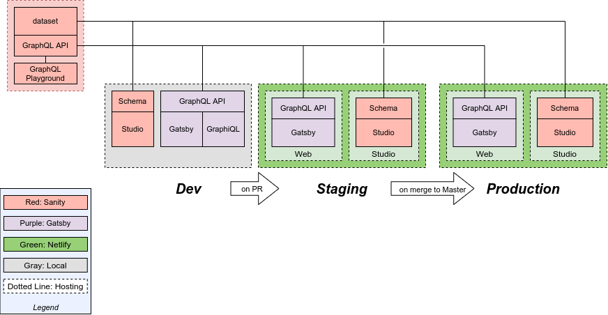

# Whitten Associates Website

Main website for Whitten Associates. [TEST UPDATE]

## Frameworks / Stack

- [Gatsby.js](https://gatsbyjs.org) as static site generator
- [Sanity.io](https://www.sanity.io) as CMS
- [Netlify](https://netlify.com) for hosting / deployment

Initially created from template project [sanity.io/create](https://www.sanity.io/create/?template=sanity-io%2Fsanity-template-gatsby-portfolio).

## Quick start

1. Clone this repository from your GitHub account
1. `npm install` in the project root folder on local
1. `npm run dev` to start the Studio and frontend locally
   - Your Studio should be running on [http://localhost:3333](http://localhost:3333)
   - Your frontend should be running on [http://localhost:8000](http://localhost:8000)
   - GraphiQL should be running on [http://localhost:8000/\_\_\_graphql](http://localhost:8000/___graphql)
1. `npm run build` to build to production locally

## Architecture and Deploy

### Front End

Front end updates are deployed automatically through the dev team processes:

- **Staging**: A "Deploy Preview" will be built and hosted on Netlify upon creation of a PR in the GitHub repo.
- **Production**: Any merge into the Production branch will trigger a deployment to Production for that branch.

### Schema

**All environments share a single Sanity dataset!** Due to this, schema changes need to be handled as follows:

1. Modifying/Deleting: Do not do this! (if necessary a migration plan needs to be discussed)
1. Adding: Please advise other team members if any new elements are created for the schema.

When updating the schema, two main actions need to be performed:

1. Sanity Studio: schema for each all deploy locations needs to be updated (handled through normal deploy process)
1. Sanity GraphQL API: the single API, hosted by Sanity, needs to be updated. To do this:
   1. Navigate to the Sanity project directory
   1. Ensure the local schema is set as desired
   1. Run command `sanity graphql deploy`

### Content

Content is managed via the Sanity Studio. Since there is a single dataset for all environments it doesn't matter from which deployment the content is modified.
